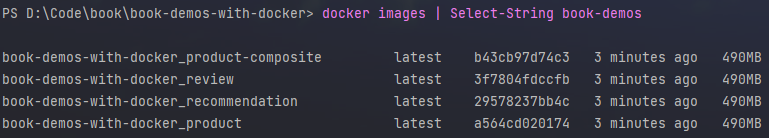
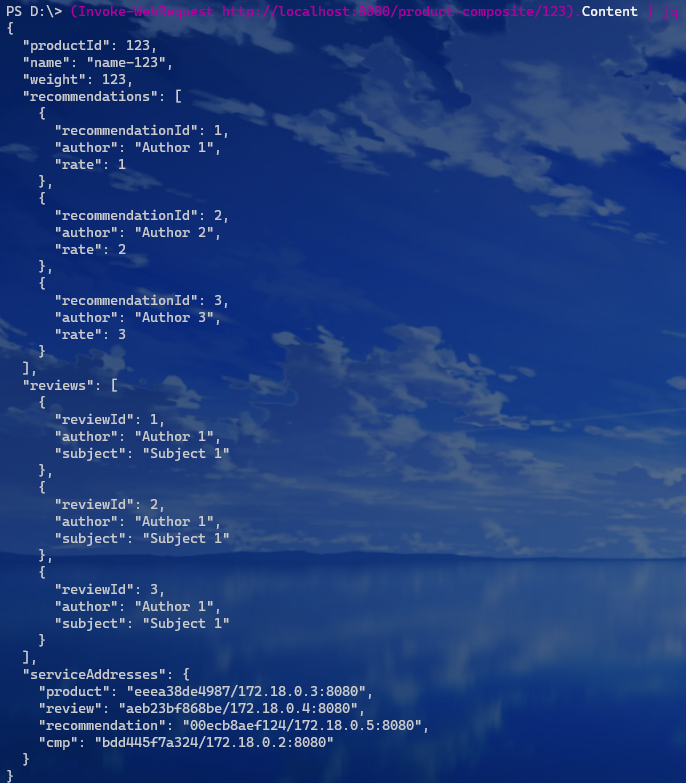
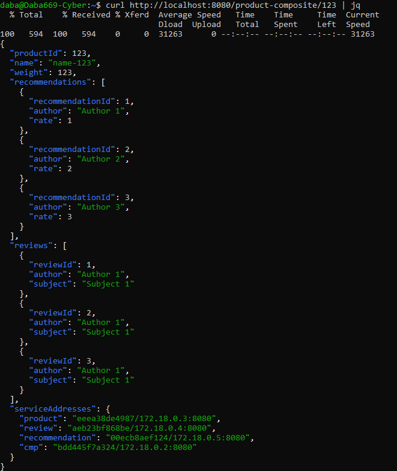

# Summary
This is a continuation of the previous demo project "spring-boot-microservices".
The essential idea that this project displays:
1. Run our microservices with Docker.
2. Manage multiple docker containers in the same host with Docker Compose and shell scripts.
3. For managing docker containers on multiple hosts, either Docker Swarm or Kubernetes is needed. Kubernetes will be demonstrated in a later demo project.

For a detailed discussion of basic docker usage, read [this](docker-for-microservice.md)

Below only discusses docker usage related to this project.

# Changes in the Source Code
1. Added `Dockerfile` under root of `product-composite-service`.
2. Added `Dockerfile` under root of `product-service`.  -   commented
3. Added `Dockerfile` under root of `recommendation-service`.
4. Added `Dockerfile` under root of `review-service`.
5. Modification in `application.yaml` of `product-composite-service`.
6. Modification in `application.yaml` of `product-service`.
7. Modification in `application.yaml` of `recommendation-service`.
8. Modification in `application.yaml` of `review-service`.
9. Added `docker-compose.yml` in project root.  -   commented

# Starting up the Microservice Landscape
1. First we need to build our deployment artifacts (the fat JARs) with gradle. Then build the Docker
   images with Docker Compose. At project root:

   `./gradlew build`

   `docker-compose build`

2. Verify that the build was successful:

   `docker images | grep <project root directory name>` using bash or `docker images | Select-String <project root directory name>`

   e.g., My project root directory has the name `book-demos-with-docker`.

   

3. Start up the microservices landscape:

   `docker-compose up -d`

   Docker Compose have similar flags with Docker. So, `-d` here means to run it in detached mode.

4. Logs:
   
   `docker-compose logs -f`
   
   We can also specify which containers' log we want to look at:
   
   `docker-compose logs -f product review` this will only display logs of `product` and `review` containers.

Now the system should be up and running on localhost:8080. Test it with the URL `http://localhost:8080/product-composite/123`

e.g., running `(Invoke-WebRequest http://localhost:8080/product-composite/123).Content | jq` on PowerShell.

or, running `curl http://localhost:8080/product-composite/123 | jq  ` on bash:

Notice how the service IP addresses have changed to the random IP address assigned by Docker.

Now use `docker-compose down` to shut down the microservice landscape.