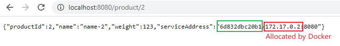

The basic unit of execution of docker is a process. For example, `docker run openjdk:12.0.2` automatically executes the Java Jshell in an isolated environment.

# 1. Commands

## 1.1. `docker ps`

Show all running containers

**Common Options:**

* `--all`, `-a`: Show all containers.
* `--last`, `-n`: Show last n created containers.
* `--latest`, `-l`: Show latest created containers.
* `--filter`, `-f`: Filter output based on conditions provided.
* `-q`: Display only the id of containers. This is very useful when `docker ps` is combined with `docker stop` or `docker rm`

## 1.2. `docker run`

By default, docker container runs in foreground mode:

`docker run ubuntu`  - Start the process in the container and attach the current console to the process’s standard input, output, and standard error.

We can also specify the exact process to run in the container by adding the command-to-run after the container name:

`docker run openjdk:12.0.2 jshell -q `. After the container starts, `jshell -q` will automatically run.

**Common Options:**

* `-d`: Run the container in a detached mode (run it in the background). Containers running in the background cannot receive input after it has started and they do not print their output to the console. One change choose to reattach the containers by using `docker attach <container name>`. If we want to see the output from running the container, we can use `docker log`.

* `-t`: Allocate a pseudo-tty. This enables docker to connect to the process being ran in a terminal-like fashion. 

  * > `docker run -t alpine cat` will give you an empty line, but if you try to type "hello", you will not get any echo. This is because while `cat` is connected to a terminal input, this input is not connected to your input. The "hello" that you typed did not reach the input of `cat`. `cat` is waiting for input that never arrives.
    >
    > 
    >
    > The `-t` option goes to how Unix/Linux handles terminal access. In the past, a terminal was a hardline connection, later a modem based connection. These had physical device drivers (they were real pieces of equipment). Once generalized networks came into use, a pseudo-terminal driver was developed. This is because it creates a separation between understanding what terminal capabilities can be used without the need to write it into your program directly (read man pages on `stty`, `curses`).

    

* `-i`: Keep STDIN open even if not attached. This attach the STDIN of the process being ran to the STDIN of docker. This is used when our process needs a one-time stdin to be able to run.

  * > `docker run -i alpine cat` gives you an empty line waiting for input. Type "hello" you get an echo "hello". The container will not exit until you send CTRL+D because the main process `cat` is waiting for input from the infinite stream that is the terminal input of the `docker run`.

* Therefore, we usually combine i and t into `-it`, which will start our process in a interactive fashion.

* `--rm`:  If instead you’d like Docker to **automatically clean up the container and remove the file system when the container exits**, you can add the `--rm` flag. Containers that started without `--rm` will have a status of `Exited` when killed or stopped.

* `-e`: Specifying the environment variable being used. e.g. `docker run --rm -p8080:8080 -e "SPRING_PROFILES_ACTIVE=docker" product-service`

* `-p`: Map the port number on the Docker host machine to the port number of the container. e.g. See example for `-e`. **Note: ** left side is host port and right side is container port. On macOS and Windows machines, since Docker is running on a Linux Virtual Machine, the `-p8080` actually maps the container port to port 8080 of the virtual machine. However, Docker automatically does port forwarding to port 8080 to the macOS or Windows machine.

* `--name`: Give the new instance of the container a name. We can use the specified name as arguments to commands like `docker stop` and `docker logs`. e.g. `docker run -d -p8080:8080 -e "SPRING_PROFILES_ACTIVE=docker" --name my-prd-srv product-service`

**Runtime Constraints on Resources:**

* `-m 2G` , `--memory=8G`: Memory limit. Unit can be b, k, m, or g. Minimum is 4M.
* `-c 0`, `--cpu-share=1024`: CPU share limit. By default, 1024 shares == 1 core.
* `--cpus=0.000`: Number of CPUs limit. 0.000 means no limit. Remember that usually 1 core has 2 virtual threads.

## 1.3. `docker stop` and `docker kill`

Stop a running docker container given id

e.g. `docker stop 1bb10`

Both commands will attempt to shutdown the container. The difference is that `docker stop` will send a SIGTERM before killing it, allowing the application running in the docker to do possible cleanup.

Kill all containers:

`docker kill $(docker ps -q)` $() is an eval expression used by Docker.

`Note:` Containers that are not run with the `--rm` flag will have a `Exited` status when stopped or killed. They can be revealed with `docker ps -a`. 

## 1.4. `docker images`

Return a list of all available images on the host machine. Combine with `grep`(bash) or `Select-String -Pattern`(Windows) to find a specific image.

## 1.5. `docker build`

Docker build is the command used to build our own images. These images then can be ran on in a container.

### 1.5.1. Dockerfile

To build a docker image using docker build, we have to use a **Dockerfile** to specify how and where to build the application. A sample Dockerfile would look like this:

### 1.5.2. Running `docker build`

After we have built the jar file using Gradle, we can now run `docker build -t product-service .`

`-t` or `--tag` allows us to give the new image a name.

The `.` tells Docker to look for the Dockerfile in this very directory.

Now, we have successfully built the image for our microservice. We start our service using:

`docker run --rm -p8080:8080 -e "SPRING_PROFILES_ACTIVE=docker" product-service`

## 1.6. `docker rm`

Remove the remains of `Exited` containers.

`-f`: Force Docker to remove the container even if it is running.

## 1.7. `docker rmi`

Remove images of containers.

## 1.8. `docker log`

Display the logs of running containers. This is particularly useful if containers were run in detached mode.

`-f`: Follow logs.

# 2. Combine with Java

> Java has historically not been very good at honoring the quotas specified for a Docker container using Linux cgroups; it has simply ignored these settings. So, instead of allocating memory inside the JVM in relation to the memory available in the container, Java allocated memory as if it had access to all the memory in the Docker host, which obviously isn't good! In the same way, Java allocated CPU-related resources such as thread pools in relation to the total number of available CPU cores in the Docker host instead of the number of CPU cores that were made available for the container JVM was running in. In Java SE 9, some initial support was provided, which was also back-ported to later versions of Java SE 8. In Java 10, however, much-improved support for CPU and memory constraints was put in place.

## 2.1. CPU Core Limit

**Let's test if Java SE 9 honors the limitations set by docker**. Run:

`echo 'Runtime.getRuntime().availableProcessors()' | docker run --rm -i --cpus 3 openjdk:9-jdk jshell -q`

We are setting the CPU limit for this docker container to be 3. Then we ask jshell to print out how many processors Java 9 is using.

Output: `$1 ==> 8`. See that Java 9 is actually using 8 cores. It ignored the setting set by docker! (My CPU is Intel i7 which has 4 physical cores and 8 logical cores). This actually happens on Java SE 9 and older. 

Since Java SE 10, many support on docker has been docker.

If we do the same on Java SE 12:

`echo 'Runtime.getRuntime().availableProcessors()' | docker run --rm -i --cpus 3 openjdk:12.0.2 jshell -q`

Output: `$1 ==> 3`

## 2.2. Memory Space Limit

By default, JVM uses 1/4 of the available heap space of the host machine.

`docker run -it --rm openjdk:12.0.2 java -XX:+PrintFlagsFinal -version | grep MaxHeapSize`

Output: `size_t MaxHeapSize     = 6708789248`.

This is about 7 GB, which is about 1 quarter of the usable heap space on my machine.

Now lets try:

`docker run -it --rm -m=1024M openjdk:12.0.2 java -XX:+PrintFlagsFinal -version | grep MaxHeapSize `

Output: `size_t MaxHeapSize    = 268435456`.

Which is about 256MB. JVM honors the limit set by docker.

###### **Manual Configuring Heap Size in Java:**

To manual set the heap size used by JVM, we can use the `-Xmx` option (More on JVM optimization refer to JVM notes).

`docker run -it --rm -m=1024M openjdk:12.0.2 java -Xmx800m -XX:+PrintFlagsFinal -version | grep MaxHeapSize `

Output: `size_t MaxHeapSize    = 838860800`.

Which is about 800MB, as expected.

**Again, let's test if Java SE 9 honors the limit set by Docker**:

`docker run -it --rm -m=1024M openjdk:9-jdk java -XX:+PrintFlagsFinal -version | grep MaxHeapSize `

Output: It will report a max heap size of about 7G. It does not honor the limit set by Docker! Instead, it simply uses the available heap of the machine that is hosting Docker containers rather.

Now, if we run the following command, something interesting happens:

`echo 'new byte[500_000_000]' | docker run -i --rm -m=1024M openjdk:9-jdk jshell -q`

If we run the above command, the Docker engine will kill the container with no mercy, throwing a `State engine terminated` error message.

This is because while JVM thinks that it can safely allocate 7G of heap space for itself, the actual permitted heap space is only 1024M according to Docker! When Java tries to allocate more than 1024M, the container ran out of memory.

`Note:` some experimental features were added Java SE 9 providing some support for Docker. But still, not all limits set by Docker are honored. So avoid using Java SE 9 or below with Docker!

# 3. Microservice Configuration for Docker Deployment

When we deploy our microservice with Docker, a few configurations are needed.

* Now our microservices will be in different Docker containers, they will each have their own port space. Therefore, we can just default the ports of our microservices to, for example, 8080.
* Each microservice will be automatically assigned an IP address from the internal network of Docker. 
* The hostname of out application will be the container ID its running in.

Sample output:

